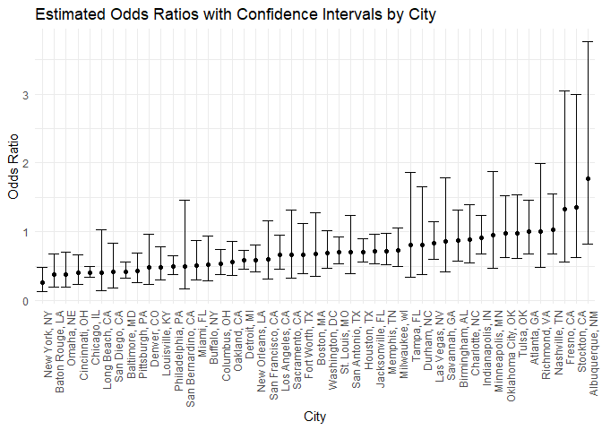
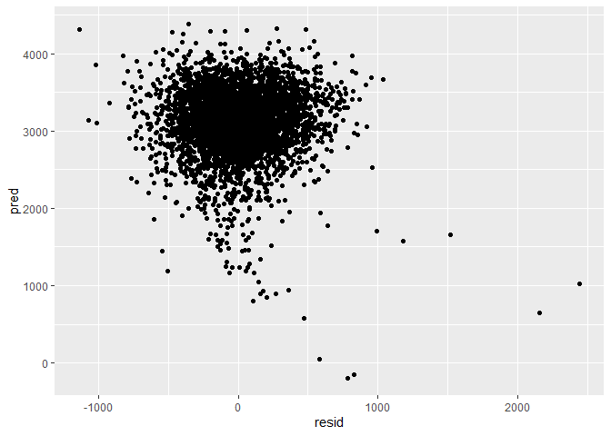
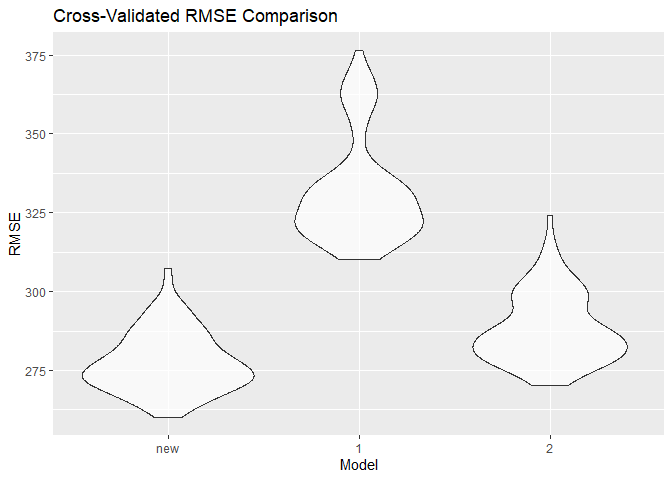

p8105_hw6_tz6259
================
Tianci Zhu

## Problem 2

Create a city_state variable (e.g. “Baltimore, MD”), and a binary
variable indicating whether the homicide is solved. Omit cities Dallas,
TX; Phoenix, AZ; and Kansas City, MO – these don’t report victim race.
Also omit Tulsa, AL – this is a data entry mistake. For this problem,
limit your analysis those for whom victim_race is white or black. Be
sure that victim_age is numeric./

Clean data:

``` r
homi <- read_csv("D:/rdata/homicide-data.csv") |> 
  janitor::clean_names() |>
  mutate(
    city_state = paste(city, state, sep = ", "),
    resolved = as.numeric(disposition == "Closed by arrest"),
    victim_age = as.numeric(victim_age),
    victim_race = fct_relevel(victim_race, "White")
  ) |> 
  filter(
    !city_state %in% c("Dallas", "Phoenix", "Kansas City", "Tulsa"),
    victim_race %in% c("White", "Black")
  ) |>
  drop_na(victim_age) 
```

    ## Rows: 52179 Columns: 12
    ## ── Column specification ────────────────────────────────────────────────────────
    ## Delimiter: ","
    ## chr (9): uid, victim_last, victim_first, victim_race, victim_age, victim_sex...
    ## dbl (3): reported_date, lat, lon
    ## 
    ## ℹ Use `spec()` to retrieve the full column specification for this data.
    ## ℹ Specify the column types or set `show_col_types = FALSE` to quiet this message.

    ## Warning: There was 1 warning in `mutate()`.
    ## ℹ In argument: `victim_age = as.numeric(victim_age)`.
    ## Caused by warning:
    ## ! NAs introduced by coercion

``` r
head(homi)
```

    ## # A tibble: 6 × 14
    ##   uid   reported_date victim_last victim_first victim_race victim_age victim_sex
    ##   <chr>         <dbl> <chr>       <chr>        <fct>            <dbl> <chr>     
    ## 1 Alb-…      20100601 SATTERFIELD VIVIANA      White               15 Female    
    ## 2 Alb-…      20100102 MULA        VIVIAN       White               72 Female    
    ## 3 Alb-…      20100126 BOOK        GERALDINE    White               91 Female    
    ## 4 Alb-…      20100130 MARTIN-LEY… GUSTAVO      White               56 Male      
    ## 5 Alb-…      20100308 GRAY        STEFANIA     White               43 Female    
    ## 6 Alb-…      20100323 DAVID       LARRY        White               52 Male      
    ## # ℹ 7 more variables: city <chr>, state <chr>, lat <dbl>, lon <dbl>,
    ## #   disposition <chr>, city_state <chr>, resolved <dbl>

Logistic regression for Baltimore, MD

``` r
balt_glm <- homi |> 
  filter(city_state == "Baltimore, MD") |> 
  glm(resolved ~ victim_age + victim_sex + victim_race, data = _, family = binomial())

baltimore_results <- balt_glm |> 
  broom::tidy(conf.int = TRUE, exponentiate = TRUE) |> 
  filter(term == "victim_sexMale") |> 
  select(term, OR = estimate, conf.low, conf.high) |> 
  rename(
    `Odds Ratio` = OR,
    `Lower CI` = conf.low,
    `Upper CI` = conf.high
  )

baltimore_results |> 
  knitr::kable(digits = 3, col.names = c("Term", "Odds Ratio", "Lower CI", "Upper CI"))
```

| Term           | Odds Ratio | Lower CI | Upper CI |
|:---------------|-----------:|---------:|---------:|
| victim_sexMale |      0.426 |    0.324 |    0.558 |

Logistic regressions for all cities

``` r
all_df <- homi |> 
  group_by(city_state) |> 
  nest() |> 
  mutate(
    model = purrr::map(data, ~tryCatch(
      glm(resolved ~ victim_age + victim_sex + victim_race, data = ., family = binomial()),
      error = function(e) NULL  # Handle errors by returning NULL
    )),
    outputs = purrr::map(model, ~if (!is.null(.)) broom::tidy(.x, conf.int = TRUE, exponentiate = TRUE) else NULL)
  ) |> 
  filter(!is.null(outputs)) |>  # Remove cities where models failed
  unnest(outputs) |> 
  filter(term == "victim_sexMale") |> 
  select(city_state, term, OR = estimate, conf.low, conf.high) |> 
  rename(
    `Odds Ratio` = OR,
    `Lower CI` = conf.low,
    `Upper CI` = conf.high
  )
```

    ## Warning: There were 45 warnings in `mutate()`.
    ## The first warning was:
    ## ℹ In argument: `outputs = purrr::map(...)`.
    ## ℹ In group 1: `city_state = "Albuquerque, NM"`.
    ## Caused by warning:
    ## ! glm.fit: fitted probabilities numerically 0 or 1 occurred
    ## ℹ Run `dplyr::last_dplyr_warnings()` to see the 44 remaining warnings.

``` r
all_df |> 
  knitr::kable(digits = 3, col.names = c("City", "Term", "Odds Ratio", "Lower CI", "Upper CI"))
```

| City               | Term           | Odds Ratio | Lower CI | Upper CI |
|:-------------------|:---------------|-----------:|---------:|---------:|
| Albuquerque, NM    | victim_sexMale |      1.767 |    0.825 |    3.762 |
| Atlanta, GA        | victim_sexMale |      1.000 |    0.680 |    1.458 |
| Baltimore, MD      | victim_sexMale |      0.426 |    0.324 |    0.558 |
| Baton Rouge, LA    | victim_sexMale |      0.381 |    0.204 |    0.684 |
| Birmingham, AL     | victim_sexMale |      0.870 |    0.571 |    1.314 |
| Boston, MA         | victim_sexMale |      0.674 |    0.353 |    1.277 |
| Buffalo, NY        | victim_sexMale |      0.521 |    0.288 |    0.936 |
| Charlotte, NC      | victim_sexMale |      0.884 |    0.551 |    1.391 |
| Chicago, IL        | victim_sexMale |      0.410 |    0.336 |    0.501 |
| Cincinnati, OH     | victim_sexMale |      0.400 |    0.231 |    0.667 |
| Columbus, OH       | victim_sexMale |      0.532 |    0.377 |    0.748 |
| Denver, CO         | victim_sexMale |      0.479 |    0.233 |    0.962 |
| Detroit, MI        | victim_sexMale |      0.582 |    0.462 |    0.734 |
| Durham, NC         | victim_sexMale |      0.812 |    0.382 |    1.658 |
| Fort Worth, TX     | victim_sexMale |      0.669 |    0.394 |    1.121 |
| Fresno, CA         | victim_sexMale |      1.335 |    0.567 |    3.048 |
| Houston, TX        | victim_sexMale |      0.711 |    0.557 |    0.906 |
| Indianapolis, IN   | victim_sexMale |      0.919 |    0.678 |    1.241 |
| Jacksonville, FL   | victim_sexMale |      0.720 |    0.536 |    0.965 |
| Las Vegas, NV      | victim_sexMale |      0.837 |    0.606 |    1.151 |
| Long Beach, CA     | victim_sexMale |      0.410 |    0.143 |    1.024 |
| Los Angeles, CA    | victim_sexMale |      0.662 |    0.457 |    0.954 |
| Louisville, KY     | victim_sexMale |      0.491 |    0.301 |    0.784 |
| Memphis, TN        | victim_sexMale |      0.723 |    0.526 |    0.984 |
| Miami, FL          | victim_sexMale |      0.515 |    0.304 |    0.873 |
| Milwaukee, wI      | victim_sexMale |      0.727 |    0.495 |    1.054 |
| Minneapolis, MN    | victim_sexMale |      0.947 |    0.476 |    1.881 |
| Nashville, TN      | victim_sexMale |      1.034 |    0.681 |    1.556 |
| New Orleans, LA    | victim_sexMale |      0.585 |    0.422 |    0.812 |
| New York, NY       | victim_sexMale |      0.262 |    0.133 |    0.485 |
| Oakland, CA        | victim_sexMale |      0.563 |    0.364 |    0.867 |
| Oklahoma City, OK  | victim_sexMale |      0.974 |    0.623 |    1.520 |
| Omaha, NE          | victim_sexMale |      0.382 |    0.199 |    0.711 |
| Philadelphia, PA   | victim_sexMale |      0.496 |    0.376 |    0.650 |
| Pittsburgh, PA     | victim_sexMale |      0.431 |    0.263 |    0.696 |
| Richmond, VA       | victim_sexMale |      1.006 |    0.483 |    1.994 |
| San Antonio, TX    | victim_sexMale |      0.705 |    0.393 |    1.238 |
| Sacramento, CA     | victim_sexMale |      0.669 |    0.326 |    1.314 |
| Savannah, GA       | victim_sexMale |      0.867 |    0.419 |    1.780 |
| San Bernardino, CA | victim_sexMale |      0.500 |    0.166 |    1.462 |
| San Diego, CA      | victim_sexMale |      0.413 |    0.191 |    0.830 |
| San Francisco, CA  | victim_sexMale |      0.608 |    0.312 |    1.155 |
| St. Louis, MO      | victim_sexMale |      0.703 |    0.530 |    0.932 |
| Stockton, CA       | victim_sexMale |      1.352 |    0.626 |    2.994 |
| Tampa, FL          | victim_sexMale |      0.808 |    0.340 |    1.860 |
| Tulsa, OK          | victim_sexMale |      0.976 |    0.609 |    1.544 |
| Washington, DC     | victim_sexMale |      0.690 |    0.465 |    1.012 |

Plotting ORs and CIs by city

``` r
ggplot(all_df, aes(x = reorder(city_state, `Odds Ratio`), y = `Odds Ratio`)) +
  geom_point() + 
  geom_errorbar(aes(ymin = `Lower CI`, ymax = `Upper CI`),) +  
  labs(
    title = "Estimated Odds Ratios with Confidence Intervals by City",
    x = "City",
    y = "Odds Ratio"
  ) +
  theme_minimal() +
  theme(axis.text.x = element_text(angle = 90, hjust = 1))
```

<!-- --> The
plot for Problem 2 shows the estimated odds ratios (ORs) and confidence
intervals (CIs) for solving homicides by city, comparing male to female
victims. Cities are ordered by OR. Most cities have ORs below 1,
indicating lower odds of resolving cases for male victims compared to
female victims. Wide confidence intervals for some cities suggest
variability or limited data in those locations.  

## Problem 3

Clean data

``` r
bw = read_csv("D:/rdata/birthweight.csv") |> 
  drop_na() |> 
  mutate(
    babysex = factor(babysex, levels = c(1, 2), 
                     labels = c("male", "female")),
    malform = factor(malform, levels = c(0, 1), 
                     labels = c("absent", "present")),
    mrace = factor(mrace, levels = c(1, 2, 3, 4, 8), 
                   labels = c("white", "black", "asian", "puerto rican", "other")),
    frace = factor(frace, levels = c(1, 2, 3, 4, 8, 9), 
                   labels = c("white", "black", "asian", "puerto rican", "other", "unknown"))
  ) |> 
  select(-pnumlbw)
```

    ## Rows: 4342 Columns: 20
    ## ── Column specification ────────────────────────────────────────────────────────
    ## Delimiter: ","
    ## dbl (20): babysex, bhead, blength, bwt, delwt, fincome, frace, gaweeks, malf...
    ## 
    ## ℹ Use `spec()` to retrieve the full column specification for this data.
    ## ℹ Specify the column types or set `show_col_types = FALSE` to quiet this message.

``` r
head(bw)
```

    ## # A tibble: 6 × 19
    ##   babysex bhead blength   bwt delwt fincome frace gaweeks malform menarche
    ##   <fct>   <dbl>   <dbl> <dbl> <dbl>   <dbl> <fct>   <dbl> <fct>      <dbl>
    ## 1 female     34      51  3629   177      35 white    39.9 absent        13
    ## 2 male       34      48  3062   156      65 black    25.9 absent        14
    ## 3 female     36      50  3345   148      85 white    39.9 absent        12
    ## 4 male       34      52  3062   157      55 white    40   absent        14
    ## 5 female     34      52  3374   156       5 white    41.6 absent        13
    ## 6 male       33      52  3374   129      55 white    40.7 absent        12
    ## # ℹ 9 more variables: mheight <dbl>, momage <dbl>, mrace <fct>, parity <dbl>,
    ## #   pnumsga <dbl>, ppbmi <dbl>, ppwt <dbl>, smoken <dbl>, wtgain <dbl>

Propose a Regression Model and Evaluate Residuals

``` r
bw_model <- lm(bwt ~ babysex + bhead + blength + delwt + frace + gaweeks + malform + mrace + momage + mheight +ppbmi + smoken + wtgain, data = bw)

summary(bw_model)
```

    ## 
    ## Call:
    ## lm(formula = bwt ~ babysex + bhead + blength + delwt + frace + 
    ##     gaweeks + malform + mrace + momage + mheight + ppbmi + smoken + 
    ##     wtgain, data = bw)
    ## 
    ## Residuals:
    ##      Min       1Q   Median       3Q      Max 
    ## -1105.22  -183.15    -3.54   173.97  2339.44 
    ## 
    ## Coefficients:
    ##                     Estimate Std. Error t value Pr(>|t|)    
    ## (Intercept)       -6311.5250   659.3538  -9.572  < 2e-16 ***
    ## babysexfemale        29.2345     8.4678   3.452 0.000561 ***
    ## bhead               131.0396     3.4518  37.962  < 2e-16 ***
    ## blength              74.8190     2.0212  37.017  < 2e-16 ***
    ## delwt                 0.5783     2.5835   0.224 0.822877    
    ## fraceblack            9.7260    46.1268   0.211 0.833011    
    ## fraceasian           16.6057    69.3186   0.240 0.810686    
    ## fracepuerto rican   -51.3788    44.6660  -1.150 0.250089    
    ## fraceother           -1.5668    74.0640  -0.021 0.983124    
    ## gaweeks              11.3194     1.4612   7.747 1.17e-14 ***
    ## malformpresent        7.6574    70.6590   0.108 0.913707    
    ## mraceblack         -152.3354    46.0636  -3.307 0.000950 ***
    ## mraceasian          -95.3341    71.9559  -1.325 0.185276    
    ## mracepuerto rican   -57.9800    45.1460  -1.284 0.199114    
    ## momage                1.0880     1.1713   0.929 0.353042    
    ## mheight               9.9962    10.3121   0.969 0.332418    
    ## ppbmi                 4.8121    14.8924   0.323 0.746615    
    ## smoken               -4.9005     0.5871  -8.346  < 2e-16 ***
    ## wtgain                3.5647     2.6129   1.364 0.172550    
    ## ---
    ## Signif. codes:  0 '***' 0.001 '**' 0.01 '*' 0.05 '.' 0.1 ' ' 1
    ## 
    ## Residual standard error: 272.7 on 4323 degrees of freedom
    ## Multiple R-squared:  0.7177, Adjusted R-squared:  0.7165 
    ## F-statistic: 610.6 on 18 and 4323 DF,  p-value: < 2.2e-16

``` r
adjust_model = lm(bwt ~ babysex + bhead + blength + gaweeks + mrace + smoken, data = bw)

summary(adjust_model)
```

    ## 
    ## Call:
    ## lm(formula = bwt ~ babysex + bhead + blength + gaweeks + mrace + 
    ##     smoken, data = bw)
    ## 
    ## Residuals:
    ##      Min       1Q   Median       3Q      Max 
    ## -1132.16  -187.84    -7.64   177.53  2439.90 
    ## 
    ## Coefficients:
    ##                     Estimate Std. Error t value Pr(>|t|)    
    ## (Intercept)       -5790.9874   100.3077 -57.732  < 2e-16 ***
    ## babysexfemale        31.5609     8.6232   3.660 0.000255 ***
    ## bhead               135.9807     3.4958  38.898  < 2e-16 ***
    ## blength              78.7124     2.0366  38.648  < 2e-16 ***
    ## gaweeks              12.3131     1.4836   8.300  < 2e-16 ***
    ## mraceblack         -138.5887     9.3606 -14.806  < 2e-16 ***
    ## mraceasian         -116.7343    42.9679  -2.717 0.006618 ** 
    ## mracepuerto rican  -136.9243    19.0024  -7.206 6.78e-13 ***
    ## smoken               -4.2275     0.5957  -7.097 1.48e-12 ***
    ## ---
    ## Signif. codes:  0 '***' 0.001 '**' 0.01 '*' 0.05 '.' 0.1 ' ' 1
    ## 
    ## Residual standard error: 278.1 on 4333 degrees of freedom
    ## Multiple R-squared:  0.7056, Adjusted R-squared:  0.7051 
    ## F-statistic:  1298 on 8 and 4333 DF,  p-value: < 2.2e-16

Plot residuals against fitted values

``` r
bw |> 
  add_predictions(adjust_model) |> 
  add_residuals(adjust_model) |> 
  ggplot(aes(x = resid, y = pred)) +
  geom_point() 
```

<!-- -->

Perform cross-validation and compute RMSE

``` r
cv_df <- 
  crossv_mc(bw, 100) |> 
  mutate(
    train = map(train, as_tibble),
    test = map(test, as_tibble),
    # Fit models to training sets
    adjust_model = map(train, ~lm(bwt ~ babysex + bhead + blength + gaweeks + mrace + smoken, data = .x)),
    model_1 = map(train, ~lm(bwt ~ blength + gaweeks, data = .x)),
    model_2 = map(train, ~lm(bwt ~ bhead * blength * babysex, data = .x)),
    # Compute RMSE manually
    rmse_new = map2_dbl(adjust_model, test, ~{
      preds <- predict(.x, newdata = .y)
      sqrt(mean((.y$bwt - preds)^2))
    }),
    rmse_1 = map2_dbl(model_1, test, ~{
      preds <- predict(.x, newdata = .y)
      sqrt(mean((.y$bwt - preds)^2))
    }),
    rmse_2 = map2_dbl(model_2, test, ~{
      preds <- predict(.x, newdata = .y)
      sqrt(mean((.y$bwt - preds)^2))
    })
  )

cv_df |> 
  select(starts_with("rmse")) |> 
  pivot_longer(
    cols = everything(),
    names_to = "model", 
    values_to = "rmse",
    names_prefix = "rmse_"
  ) |> 
  mutate(model = fct_inorder(model)) |> 
  ggplot(aes(x = model, y = rmse)) +
  geom_violin(alpha = 0.7) +
  labs(title = "Cross-Validated RMSE Comparison", x = "Model", y = "RMSE")
```

<!-- -->
